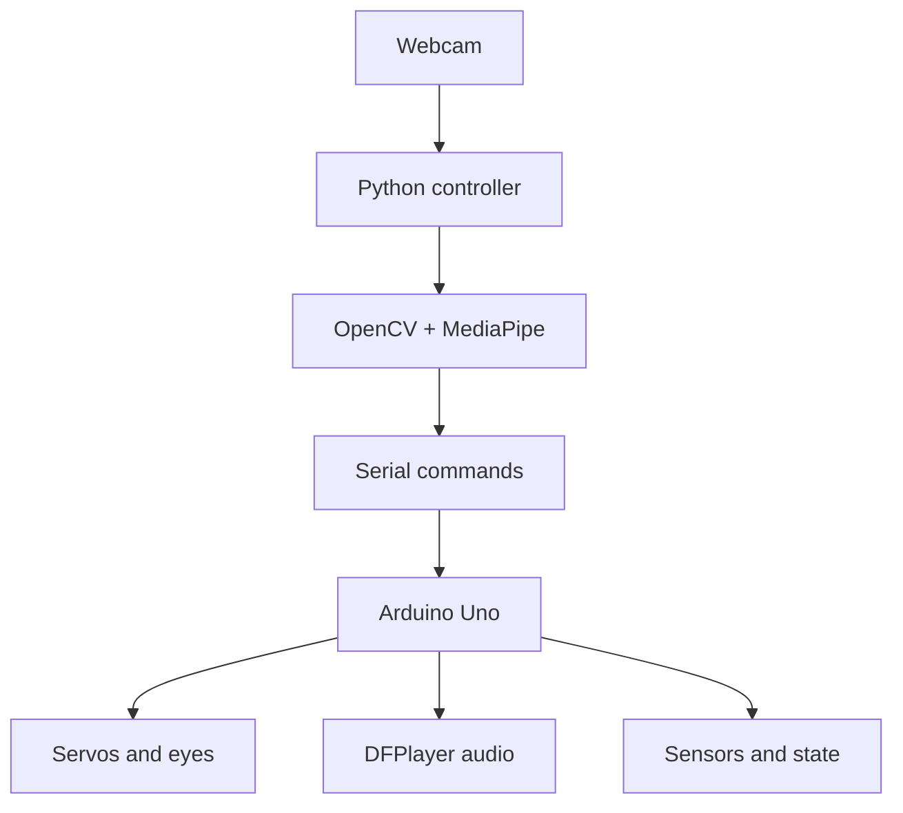

# Gesture Interaction Robot (GIR)

<p align="center">
  <strong>Computer vision, embedded control, and natural hand-gesture interaction in one humanoid robotics project.</strong>
</p>

<p align="center">
  
  
  
  <a href="LICENSE"></a>
</p>


## Overview

GIR is an interactive humanoid robot that recognizes hand gestures with Python, OpenCV, and MediaPipe, then sends high-level commands to an Arduino for physical movement, lighting, and audio feedback.

## Highlights

- Real-time left- and right-hand tracking
- Finger-count and gesture-based controls
- Smooth eased motion for arms, head, and body
- Serial communication between Python and Arduino
- DFPlayer Mini voice and sound feedback
- Eye control and double-clap interaction
- EEPROM state memory
- Failsafe behavior when tracking is lost

## Architecture



## Gesture controls

| Input | Robot action |
|---|---|
| Right hand | Raise or lower the right arm |
| Left hand | Raise or lower the left arm |
| Right index finger | Control head direction |
| Right thumb and index | Rotate the body |
| Double clap | Toggle power or trigger behavior |

## Repository structure

```text
├── src/
│   ├── python/gir_controller.py
│   └── arduino/gir_arduino.ino
├── models/hand_landmarker.task
├── assets/voice/
├── hardware/hardware.md
├── schematic/
├── docs/presentation.html
└── media/
    ├── photos/
    └── video/
```

## Setup

### Software

```bash
git clone https://github.com/unesjami/Gesture-Interaction-Robot-GIR-.git
cd Gesture-Interaction-Robot-GIR-
python -m venv .venv
pip install -r requirements.txt
```

Review the serial-port setting in `src/python/gir_controller.py`, connect the Arduino, and run:

```bash
python src/python/gir_controller.py
```

Upload `src/arduino/gir_arduino.ino` to the Arduino separately through the Arduino IDE.

### Hardware

Use the files in [schematic](schematic/) and [hardware](hardware/) as the wiring reference. Confirm every servo has adequate power and a shared ground before enabling motion.

## Media and presentation

- [Demonstration video](media/video/GIR%20video.mp4)
- [Project presentation](docs/presentation.html)
- [KiCad schematic](schematic/GIR%20schematic.kicad_sch)

## Safety

Disconnect power before rewiring. Do not power multiple servos from the Arduino 5 V pin; use a suitable external supply and connect grounds together.

## License

Released under the [MIT License](LICENSE).

## Author

Created by [Unes Jami](https://github.com/unesjami).
